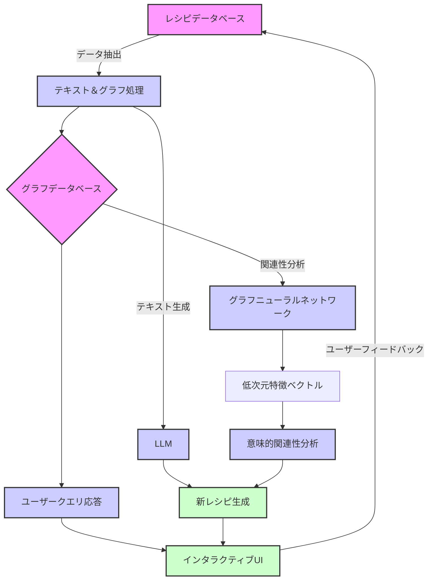

# Haru's Note

```mermaid
graph TD
    A[レシピデータベース] -->|データ抽出| B[テキスト＆グラフ処理]
    B --> C{グラフデータベース}
    C -->|関連性分析| D[グラフニューラルネットワーク]
    D --> E[低次元特徴ベクトル]
    E --> F[意味的関連性分析]
    B -->|テキスト生成| G[LLM]
    G --> H[新レシピ生成]
    C --> I[ユーザークエリ応答]
    I --> J[インタラクティブUI]
    H --> J
    F --> H
    J -->|ユーザーフィードバック| A

    classDef database fill:#f9f,stroke:#333,stroke-width:2px;
    class A,C database;
    classDef process fill:#ccf,stroke:#333,stroke-width:2px;
    class B,D,F,G,I process;
    classDef output fill:#cfc,stroke:#333,stroke-width:2px;
    class H,J output;
```